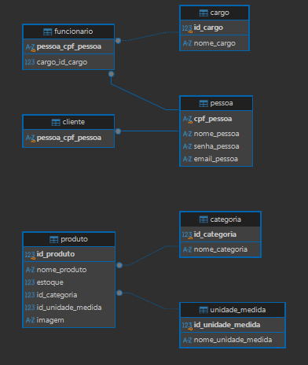

# LUMIÈRE | Velas Aromáticas

## Sobre o projeto

O **Lumière** é um sistema web desenvolvido para o gerenciamento de uma loja de velas aromáticas.

O sistema permite realizar o gerenciamento de **produtos, categorias e clientes**, além de possuir um sistema de **login para controle de acesso dos funcionários**.

O projeto foi desenvolvido como atividade da disciplina de **Desenvolvimento Web 1 (DW1)**.

## Tecnologias utilizadas

- HTML
- CSS
- JavaScript
- Node.js
- Express
- PostgreSQL
- Git
- GitHub

## Como executar o projeto

### 1. Instalar as dependências

Abra o terminal na pasta `back` do projeto e execute:

```bash
npm install
```

### 2. Configurar o banco de dados

Crie um banco de dados no PostgreSQL.

Depois, execute o arquivo SQL do projeto para criar as tabelas, os relacionamentos e inserir os dados.

### 3. Configurar o arquivo `.env`

Crie um arquivo `.env` dentro da pasta `back` com as informações do seu banco de dados PostgreSQL:

```env
DB_HOST=localhost
DB_PORT=5432
DB_NAME=nome_do_banco
DB_USER=postgres
DB_PASSWORD=sua_senha
```

### 4. Iniciar o servidor

No terminal, dentro da pasta `back`, execute:

```bash
node server.js
```

O servidor será executado na porta `3001`.

### 5. Acessar o sistema

Após iniciar o servidor, abra no navegador a página:

```text
front/menu/menu.html
```

## Banco de dados

O banco de dados do projeto foi desenvolvido utilizando **PostgreSQL**.

As principais tabelas utilizadas são:

- `pessoa`
- `cliente`
- `funcionario`
- `cargo`
- `categoria`
- `produto`
- `unidade_medida`

O banco possui relacionamentos **1:1** e **1:N**.

### Relacionamentos 1:1

- `pessoa` → `cliente`
- `pessoa` → `funcionario`

### Relacionamentos 1:N

- `cargo` → `funcionario`
- `categoria` → `produto`
- `unidade_medida` → `produto`

## Diagrama do banco de dados

O diagrama abaixo apresenta a estrutura do banco de dados e seus relacionamentos.



## Desenvolvedora
**Yasmin Oliveira da Silva**
DW1 | 2026